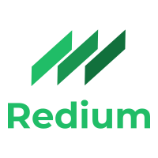

# Redium

> Story telling service created with React and Redux and Docker

---

## 

## Table of Contents

- [Getting Started](#getting-started)

- [Features](#features)

- [Contributing](#contributing)

- [Support](#support)

- [License](#license)

---

# Getting Started

### Clone

- Clone this repo to your local machine using `https://github.com/Curti-s/Redium.git`
- Run `docker-compose up --build` to build the containers

---

# Features

> This project uses ReactJs / Redux for the front-end and Express / NodeJs for the back-end. It depicts a story telling service like [Medium](http://medium.com/), where users can sign up / sign in and share their stories.

> Auth0 was used to facilitate the sign up/in process. The develop API keys are used.

---

# Contributing

### Step 1

- **Option 1**

  - 🍴 Fork this repo!

- **Option 2**
  - 👯 Clone this repo to your local machine using `git clone https://github.com/Curti-s/Redium.git`

### Step 2

- **HACK AWAY!** 🔨🔨🔨

### Step 3

- 🔃 Create a new pull request

---

# Author

> [Kirimi](https://github.com/Curti-s)

---
